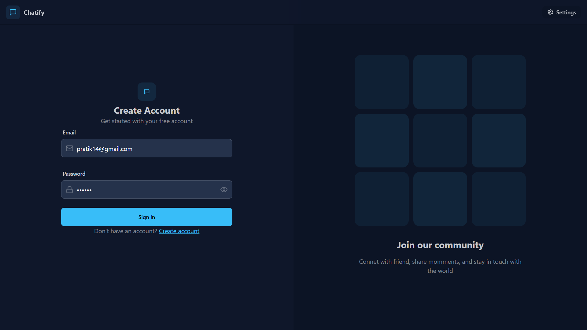
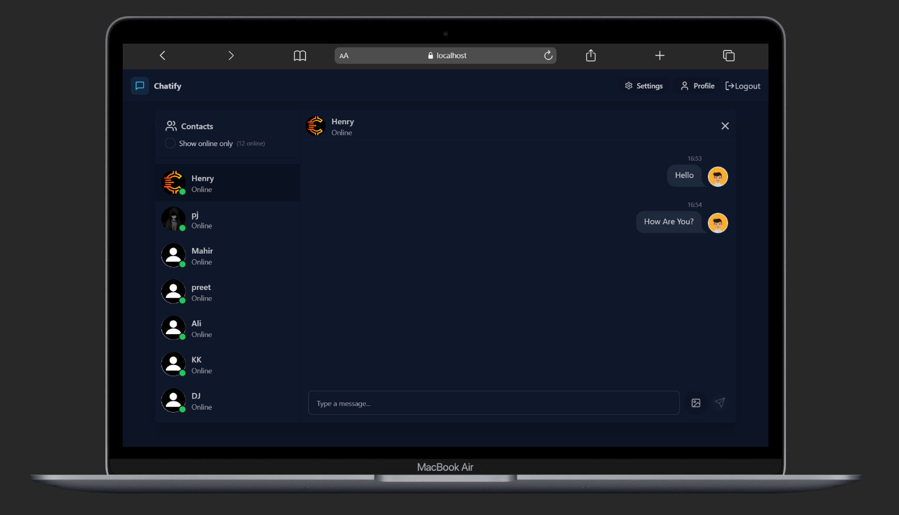
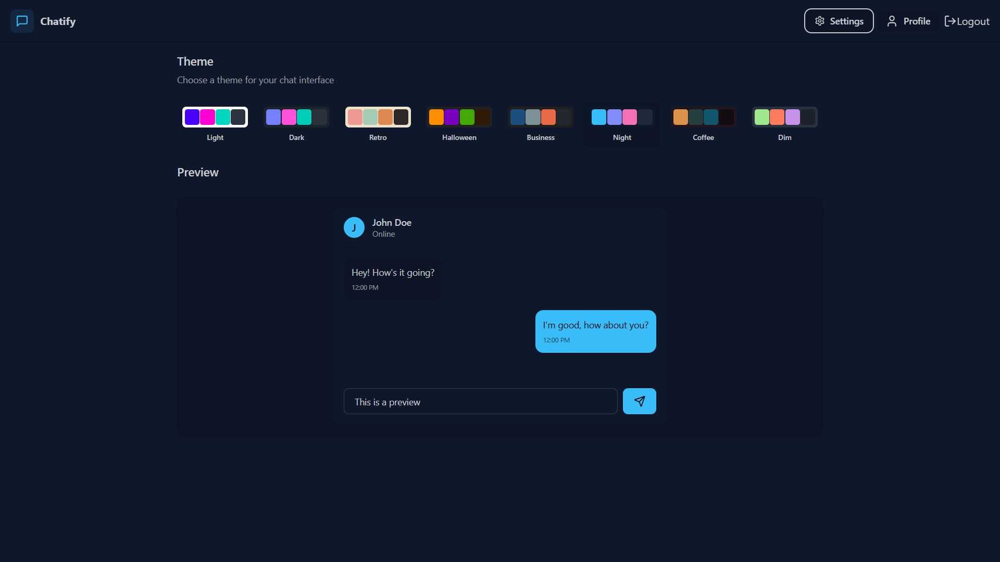

# 💬 Chatify - Real-Time Chat Application

Chatify is a full-stack real-time chat application built using the MERN stack. It allows users to communicate instantly with a modern UI and smooth user experience.

---

## 🚀 Features

- 🔐 User Authentication (Signup/Login)
- 💬 Real-time messaging (Socket.io)
- 🟢 Online/Offline user status
- 📸 Image sharing support
- 🔔 Instant notifications
- 🌙 Responsive & modern UI
- 🧑‍🤝‍🧑 One-to-one chat functionality

---


## 🌐 Live Demo

👉 Add your deployed link here
Example:

```
https://real-time-chat-app-r8u5.onrender.com/
```
---

## 🛠️ Tech Stack

### Frontend:
- React.js (Vite)
- Tailwind CSS
- Axios
- Socket.io-client

### Backend:
- Node.js
- Express.js
- MongoDB (Mongoose)
- Socket.io

---

## 📁 Folder Structure

```

Chatify/
│
├── backend/
│ ├── src/
│ ├── controllers/
│ ├── routes/
│ └── models/
│
├── frontend/
│ ├── dist/
│ ├── node_modules/
│ ├── public/
│ ├── src/
│ │ ├── ...

````

---

## 📸 Screenshots


### 🔑 Login Page


### 📝 Profile Page


### 💬 Chat Interface


### ⚙️ Setting Page


---

## ⚙️ Installation & Setup

### 1️⃣ Clone the Repository

```bash
git clone https://github.com/your-username/chatify.git
cd chatify
````

---

### 2️⃣ Setup Backend

```bash
cd backend
npm install
```

Create a `.env` file in backend:

```env
PORT=5001
MONGO_URI=your_mongodb_connection_string
JWT_SECRET=your_secret_key
```

Run backend:

```bash
npm start
```

---

### 3️⃣ Setup Frontend

```bash
cd frontend
npm install
npm run dev
```

---

## 🔌 Environment Variables

| Variable   | Description                   |
| ---------- | ----------------------------- |
| MONGO_URI  | MongoDB connection string     |
| JWT_SECRET | Secret key for authentication |
| PORT       | Backend server port           |


---

## 🤝 Contributing

Contributions are welcome!
Feel free to fork this repo and submit a pull request.

---

## 📬 Contact

👤 **Pratik Jetani**

---

## ⭐ Show Your Support

If you like this project, give it a ⭐ on GitHub!

---

````
